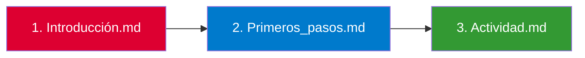

# 🅰️ Tutorial de Angular - Guía Completa

## 📝 Descripción

Este repositorio contiene una guía completa para aprender Angular desde cero. El material está organizado en secciones principales que cubren desde los conceptos básicos hasta la implementación de una aplicación práctica con routing y componentes.

## 📚 Contenido del Proyecto

<table>
  <tr>
    <th>Documento</th>
    <th>Descripción</th>
    <th>Temas Cubiertos</th>
  </tr>
  <tr>
    <td><b>1. Introducción a Angular</b></td>
    <td>Visión general de Angular y sus fundamentos</td>
    <td>
      ✅ Qué es Angular y por qué se utiliza 
      ✅ Ventajas principales del framework 
      ✅ Importancia en el desarrollo web moderno 
      ✅ Prerrequisitos técnicos 
      ✅ Conceptos fundamentales
    </td>
  </tr>
  <tr>
    <td><b>2. Primeros Pasos con Angular</b></td>
    <td>Guía paso a paso para comenzar con Angular</td>
    <td>
      ✅ Instalación de Node.js y npm 
      ✅ Configuración de Angular CLI 
      ✅ Creación de un primer proyecto 
      ✅ Estructura de un proyecto Angular 
      ✅ Componentes básicos 
      ✅ TypeScript en Angular
    </td>
  </tr>
  <tr>
    <td><b>3. Actividad Práctica: Juego de Números</b></td>
    <td>Ejercicio práctico para aplicar conocimientos</td>
    <td>
      ✅ Componentes standalone 
      ✅ Configuración de routing 
      ✅ Navegación con RouterLink 
      ✅ Generación de números aleatorios 
      ✅ Directivas estructurales (if/else) 
      ✅ Estilización con CSS
    </td>
  </tr>
</table>

## 🚀 Cómo Usar Este Material

1. 📖 Comienza leyendo el documento **"1. Introducción.md"** para familiarizarte con los conceptos básicos de Angular
2. 🛠️ Continúa con **"2. Primeros_pasos.md"** para configurar tu entorno de desarrollo y crear tu primer proyecto
3. 🎮 Finalmente, sigue las instrucciones en **"3. Actividad.md"** para implementar un juego de números aleatorios y practicar lo aprendido

## ⚙️ Prerrequisitos

| Requisito | Descripción |
|-----------|-------------|
| 💻 **Conocimientos** | HTML, CSS y JavaScript básicos |
| 📝 **Editor** | Visual Studio Code (recomendado) |
| 🔧 **Herramientas** | Node.js y npm instalados |

## 🔗 Recursos Adicionales

## ⚠️ Notas Importantes

> [!IMPORTANT]
> - Para la actividad práctica, asegúrate de crear el proyecto Angular con routing habilitado (`--routing=true`)
> - Sigue las instrucciones paso a paso para obtener mejores resultados
> - Los archivos de este repositorio son guías de aprendizaje, no un proyecto Angular en sí mismo

---

### 🅰️ ¡Feliz aprendizaje con Angular!

